**Last updated 12th June, 2018**

## Add a new user into LDAP

First, you need to connect to your **LDAP Admin** with the URL:
  
**https://ldap.<your-cluster>.datalake.ovh:8080** where **<your-cluster>** is the name of your deployed cluster.

To connect to your **LDAP Admin**, you need to enter your **login** and **password**.
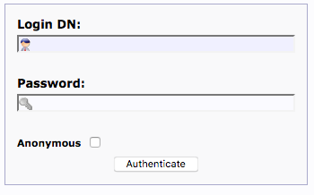

```
Login DN : cn=<your-admin-ldap>,dc=<your-cluster>,dc=datalake,dc=ovh
Password: <your-LDAP-admin-password>
```

When you are logged, you have this tree view on the left side of the screen

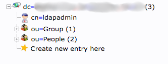

To create a new user, you need to click on **Create new entry here** on the **ou=People** folder.
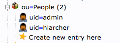

Then, you select the template **Generic: User Account**
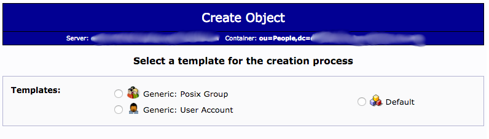

You set the fields with the values (ie. Bob Lebricoleur in this example) for your new user account and you click on the **Create object** button.
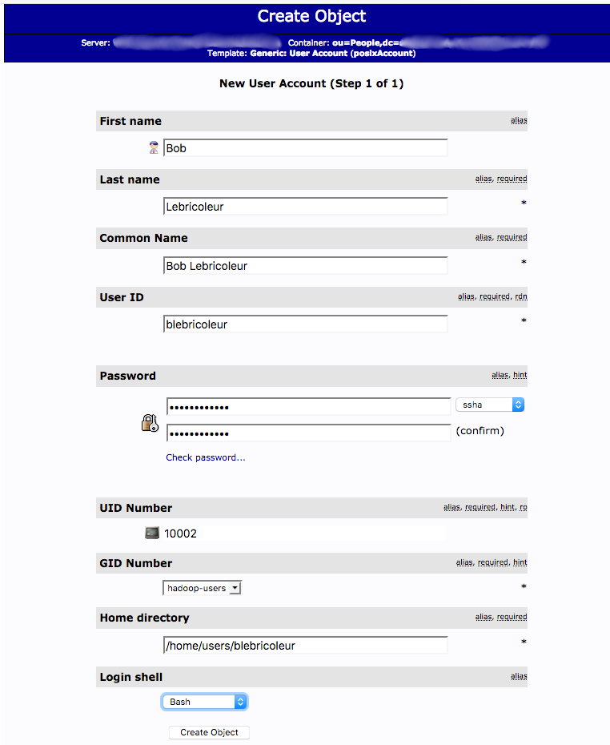

On the **Create LDAP Entry** screen, you click on the **Commit** button to update LDAP Database.
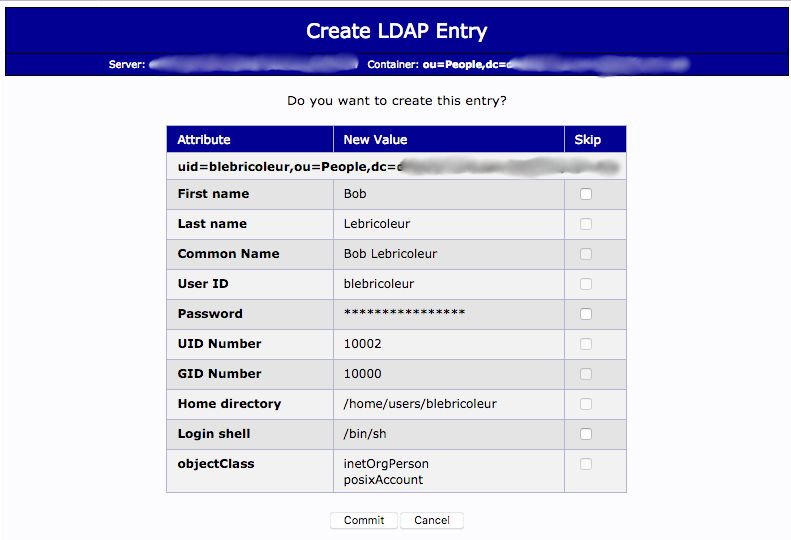

When you commit your update, the **ou=People** list is updated with your new user account created (ie. belebricoleur in this example).

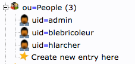

The user is created and you need to add it to the group members. For that, you need to display your group details 
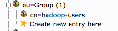

On the group details screen, click on **add value**
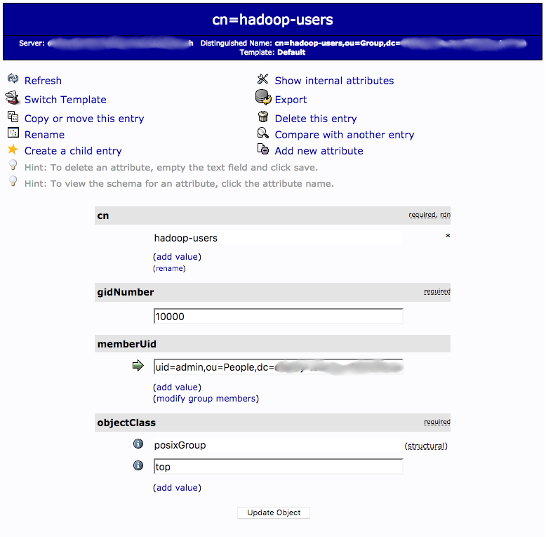

On the field, you need to input the user uid to add (like ``uid=blebricoleur,ou=People,dc=<your-ldap-configuration-dc>``) 
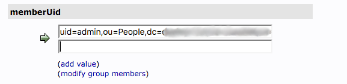
And click on **Update object**

Click on **Update object** button
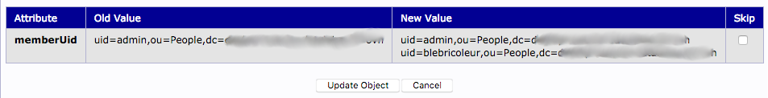
 
Then your user is added to the memberUid
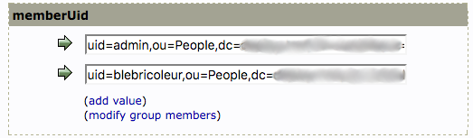

## Add a new user into Knox and Ranger

You don't need to specifically add your new user into **Knox and Ranger**, the user created is **automatically** pushed into Ranger with Knox.

To check if the user creation is ok, you can connect to your **Ranger interface** with this URL **https://knox.<your-cluster>.datalake.ovh/gateway/default/ranger** (<your-cluster> is the name of your cluster)

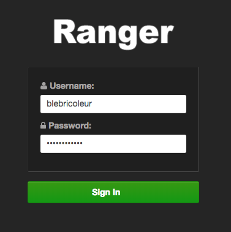   

And then you can access **Ranger Service Manager**
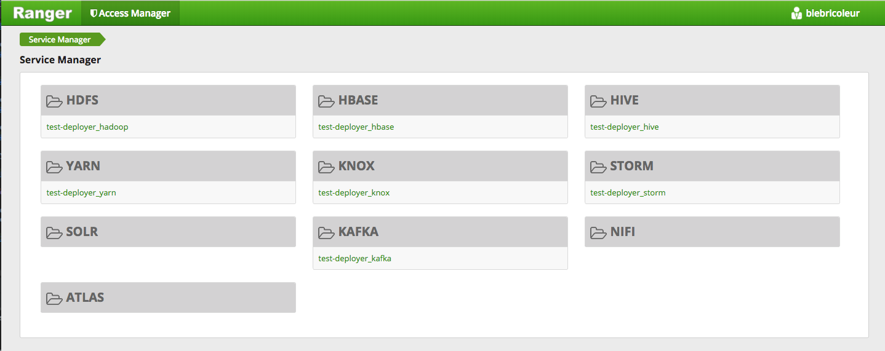

## Synchronize new user with Ambari users

When your new user is created, you need to synchronize LDAP with Ambari users to update users account. 

To do that, you need to launch a terminal connected on your cluster (you can use **Guacamole** for that). 
After authentication on **Guacamole**, you can launch command:
```bash
sudo ambari-server sync-ldap --users=LDAP_SYNC_USERS --groups=LDAP_SYNC_GROUPS --existing
```

The command prompt ask for your Ambari user admin and password to synchronize existing LDAP accounts.

You can also use a CURL command to synchronize existing LDAP accounts:
```bash
curl -u<ambari_user_admin>:<ambari_password> -H 'X-Requested-By: ambari' 
-X POST -d '[{"Event": {"specs": [{"principal_type": "users", "sync_type": "existing"}, 
{"principal_type": "groups", "sync_type": "existing"}]}}]' 
http://<your_cluster_IP>:8080/api/v1/ldap_sync_events
```

Then you can connect to your Ambari server with your new user
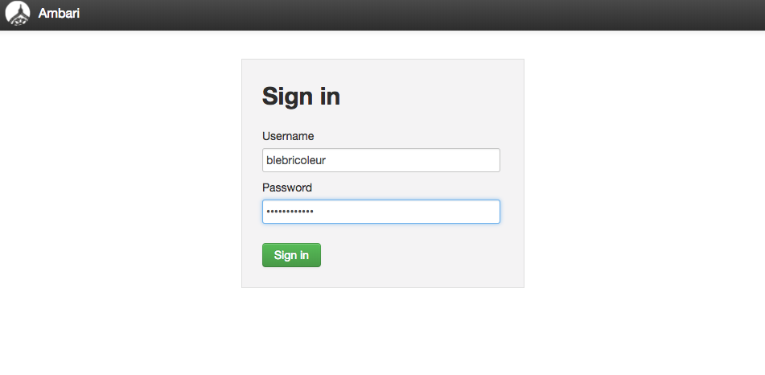

## Update user access to a View

When the new user connects first time on Ambari server, there are no views to display.
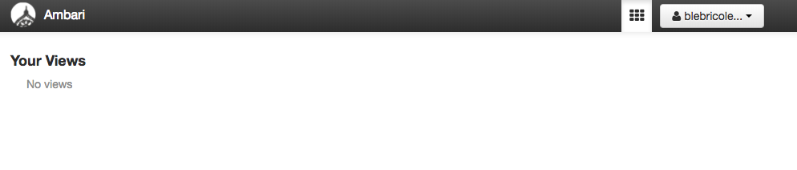

To add access to a view for the new user, you need to go into **admin** > **Manage Ambari** choice.
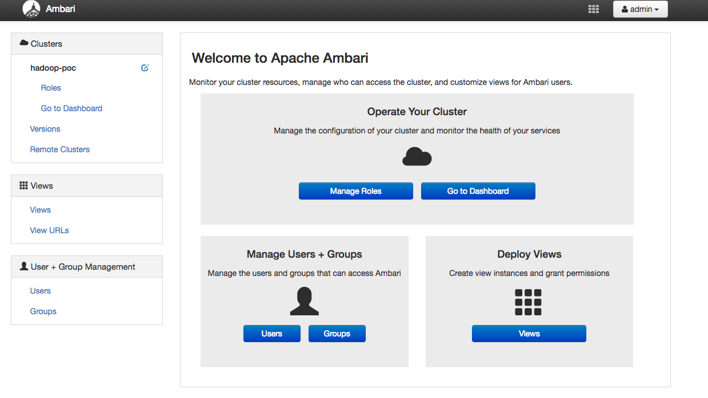

Click on **Views** on the left menu.
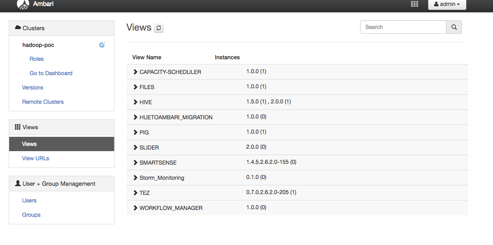

For example, you can add Pig view for the new user account. To do that, you click on **PIG** label to deploy the Pig View, and you click on **Pig** link to display Pig View configuration.
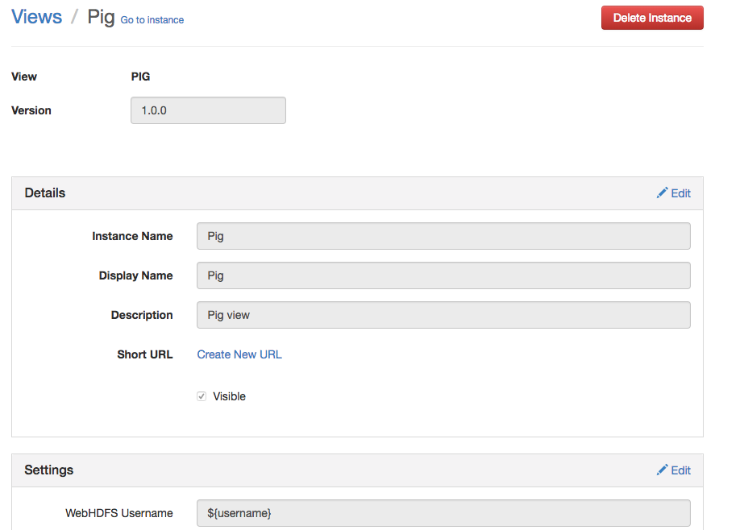

Go to the permissions (on the bottom of the page) and Grant permission for the new user.
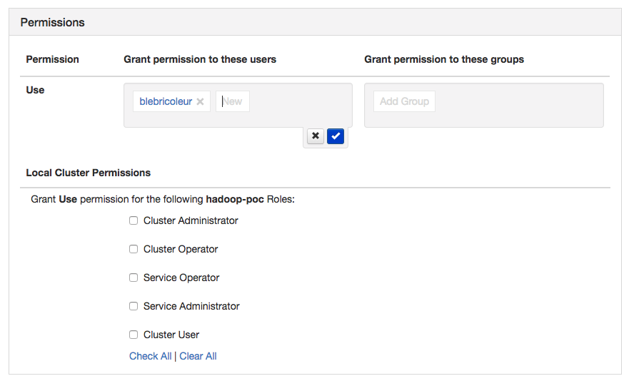
And click on **Blue check** to validate your input.

To check your update, you can log in again to Ambari server with the updated user
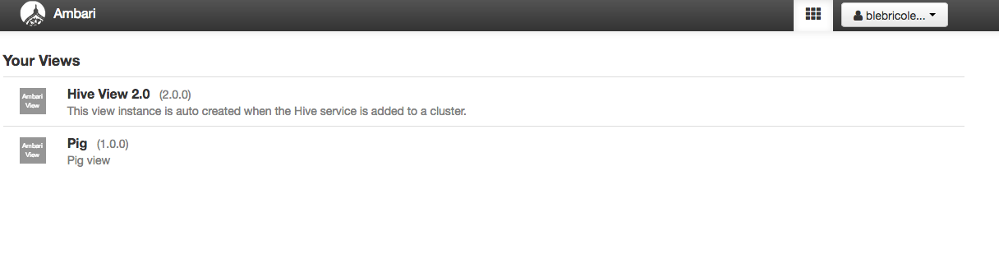

If you have an error about **File does not exist: /user/<new_user>** when you're gone on the new view, you need to create the user directory in **HDFS**.

To do that, you need to launch a terminal connected on your cluster (you can use **Guacamole** for that). 
After authentication on **Guacamole**, you can launch command (for example to "blebricoleur" user):   
```bash
sudo su - hdfs
hdfs dfs -mkdir /user/blebricoleur
hdfs dfs -chown blebricoleur:hadoop /user/blebricoleur
```