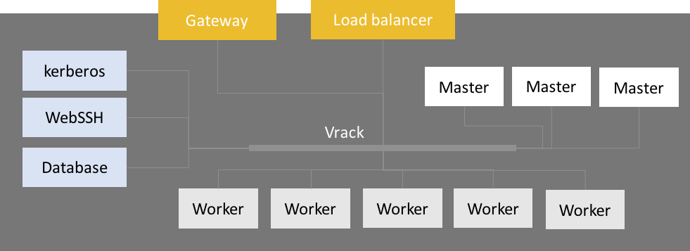

## What is OVH Analytics ?

OVH Analytics is as a fully flexible and secure solution specially designed **to store and analyse high volume of data**, based on an install of a **complete Hadoop stack** for analytics.

Traditionally, the data management approaches are based on relational RDBMS (MySQL, MSSQL,...), Data scattered in legacy operational systems, NAS filesystems, Excel powered spreadsheets and charts. But growth of data volume is exponential, lots of business value lies in data-crossing and analyics, data is becoming heterogeneous and unstructured.

Those systems can't scale or handle the load.

For those reasons, the Big Data approach is an answer and use 4 V's to explain that :

* **Volume** (Data at Scale) : Store, compute and visualize terabytes to petabytes of data. Handle exponentially growing dataset.
* **Variety** (Data in many forms) : Data is heterogeneous, can be structured, semi structured or unstructured.
* **Velocity** (Data in motion) : Data can be at rest but also created or updated at high velocity.
* **Veracity** (Data uncertainty) : More data can mean less confidence and increase risk of wrongly based business decisions.

OVH Analytics is based on **[Hortonworks Data Platform&trade;](https://hortonworks.com/products/data-platforms/hdp/) (HDP&reg;)**, which is a reference stack. **Hortonworks&trade;** is an opensource driven company and highly contributes to Hadoop ecosystem.

Once your order is passed, you can start working on your business cases in the following hours! You can operate your infra anywhere with a fully configured **Web SSH** based on [Guacamole&reg;](https://guacamole.apache.org/). 

You'll have a full root access to your cluster, the governance is fully installed and ready to use (**Kerberos**, **Ranger**, **LDAP**). Your cluster, only accessible through HTTPS, is sized to be ready to use and is isolated from the internet with outbound access only. The user access control and audit are made through **Apache Ranger**.

## Technical considerations

This generic schema of your cluster consists of a cluster with all service pre-installed. Hadoop services are installed on **Workers and Masters nodes**. We provide a **network gateway** and a **reverse proxy** in order to make services accessible from outside.
There are 3 services nodes for : **Kerberos**, **[Guacamole&reg;](https://guacamole.apache.org/)** and Database backend (**[Hive](https://hive.apache.org/)** metastore).  

## Services availability

The table below lists services available on your cluster after its creation. 

| Dataflow Services  | Security Services | Storage | Monitoring Services | Scheduling Services | Messaging Services | Processing Services |
|--------------------|-------------------|---------|---------------------|---------------------|--------------------|---------------------|
| Sqoop              | Ranger            | HDFS    | Ambari Metrics      | Oozie               | Kafka              | YARN                |
| Flume              | Kerberos          | HBase   | Logs Search         |                     |                    | Map Reduce 2        |
|                    | Knox              | Ambari Infra |                |                     |                    | Tez                 |
|                    | LDAP Server       |         |                     |                     |                    | Pig                 |
|                    | Load Balancer     |         |                     |                     |                    | Slider              |
|                    |                   |         |                     |                     |                    | Hive                |
|                    |                   |         |                     |                     |                    | Spark               |