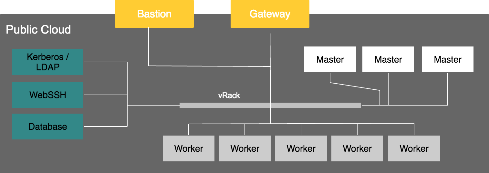

**Last updated 30   th May, 2018**

## What is OVH Analytics ?

OVH Analytics provides a one-click pre-configured Hadoop stack designed to store and process high volumes of data across OVH Public Cloud infrastructure.

The solution is based on **[Hortonworks Data Platform&trade;](https://hortonworks.com/products/data-platforms/hdp/) (HDP&reg;)** and feature many of the popular frameworks of the Hadoop ecosystem, including **[HDFS](https://hortonworks.com/apache/hdfs/)**, **[Hive](https://hortonworks.com/apache/hive/)**, **[HBase](https://hortonworks.com/apache/hbase/)**, **[Kafka](https://hortonworks.com/apache/kafka/)**, **[Spark](https://hortonworks.com/apache/spark/)** and **[Presto](https://prestodb.io/)**.

OVH Analytics can handle a wide range of use cases including business intelligence, IoT, marketing analysis, AI, data cleaning, and predictive maintenance.

## One-click big data platform

Once ordered, your cluster is provisioned in less than 1 hour. OVH Analytics takes care of the whole Hadoop configuration: you are all setup to start working straight away.

## Customizable

You have full control over your cluster and are given root access to services and instances. You can monitor, install new services and operate your cluster from your web browser using **Apache Ambari** or directly using an integrated **Web SSH terminal**.

## Secure

Kerberos authentication is enabled out of the box on all OVH Analytics clusters. You can easily manage all the cluster users via a **pre-installed LDAP directory** and web interface. Access control and fine-grained auditing is made possible by the integrated **Apache Ranger** service.

Your OVH Analytics cluster benefits from **OVH vRack** technology, isolating all instances from inbound internet access inside a private network. External access is only possible through an authenticated **HTTPS Apache Knox** gateway.

## Open-source and reversibility

Forget about vendor-lock, OVH Analytics is based on the fully open-source **Hortonworks Data Platform&trade; (HDP&reg;)**. Hortonworks&trade; is an opensource driven company and highly contributes to Hadoop ecosystem.

## Technical considerations

Hadoop services are installed on **Workers and Masters nodes**. We provide a **network gateway** and a **bastion** in order to make services accessible from the outside world. There are 3 services nodes for: **Kerberos** and **LDAP** authentication, **[Apache Guacamole WebSSH](https://guacamole.apache.org/)** and a database backend (Apache Ambari and Hive metastore).

## Available services

The table below lists services available on your cluster after its creation. 

| Dataflow Services  | Security Services | Storage | Monitoring Services | Scheduling Services | Messaging Services | Processing Services |
|--------------------|-------------------|---------|---------------------|---------------------|--------------------|---------------------|
| Sqoop              | Ranger            | HDFS    | Ambari Metrics      | Oozie               | Kafka              | YARN                |
| Flume              | Kerberos          | HBase   | Logs Search         |                     |                    | Map Reduce 2        |
|                    | Knox              |         | Ambari Infra        |                     |                    | Tez                 |
|                    | OpenLDAP Server   |         |                     |                     |                    | Pig                 |
|                    |                   |         |                     |                     |                    | Slider              |
|                    |                   |         |                     |                     |                    | Hive                |
|                    |                   |         |                     |                     |                    | Spark               |
|                    |                   |         |                     |                     |                    | Presto              |

## Use cases

BI/IoT/predictive maintenance/fraud detection/ETL